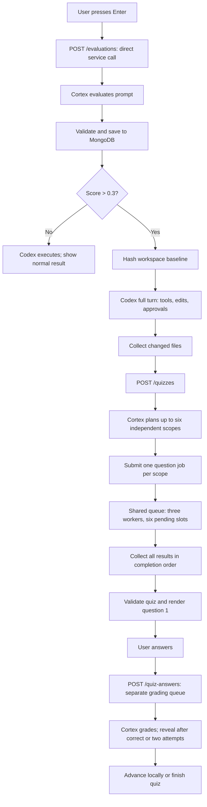

# Prompt-to-quiz latency



Evaluation bypasses the job queue. Planning is one Cortex call; a six-question
quiz then makes six independent question calls, with at most three active question
workers shared across all requests. Planning happens outside that queue so it
cannot occupy workers while waiting for its own question jobs. Each response is
non-streaming. The TUI receives the entire batch before showing question 1.

The first-question critical path is evaluation + baseline + Codex turn + collection
+ scope planning + concurrent question batch + UI preparation. With equal question
latencies and no other traffic, six jobs take roughly two waves of three. Increasing
question concurrency does not shorten evaluation, planning, or Codex execution.
There is no automatic retry or continuation loop after the batch succeeds.

## Capture one run

Restart the server with current code. From `server/`, in one terminal:

```sh
go run ./cmd/server 2>&1 | tee /tmp/cortisol-server.log
```

In another terminal, from `server/` (also Codex's working directory):

```sh
go run ./cmd/tui --timing-log /tmp/cortisol-tui-timing.jsonl
```

Submit an ambiguous prompt, wait for question 1, then answer it. Timing records
go to a separate file so they do not corrupt the full-screen TUI. Add `--log` to
capture raw RPC traffic when investigating the Codex handoff or approvals. Raw
RPC logs can contain code and prompts; timing events do not.

Each prompt has a `trace_id`; each HTTP request has a `request_id` to match
client/server spans. The planning and question calls within `/quizzes` share the
request's IDs. Multiple `cortex.total` and `queue.work` events are expected for
one quiz request. The question calls overlap and may finish out of order. A
six-question success produces seven Cortex completions: one plan and six jobs.
Server timings appear even without the flag but lack TUI end-to-end correlation.

Read both logs together:

```sh
python3 internal/timing/summarize.py \
  /tmp/cortisol-tui-timing.jsonl /tmp/cortisol-server.log
```

Add `--trace <trace_id>` to isolate one prompt. Events are ordered by completion
timestamp. Durations use local elapsed time; clock synchronization only affects
ordering across machines, not durations.

## Find the slow stage

| Event | Measurement | What a large value suggests |
| --- | --- | --- |
| `quiz.first_question_ready` | Enter through first-question UI readiness | Overall wait; excludes physical terminal paint |
| `http.client` / `evaluations` | Evaluation round trip | Compare Cortex and MongoDB spans; no queue |
| `queue.wait` | Submission until a worker dequeues a question or grade | Worker saturation |
| `queue.work` | One question/grade worker's processing time | Includes its Cortex call and validation |
| `cortex.total` | One Cortex call, networking and decoding included | Model/provider/network/output latency |
| `cortex.response_headers` | Dispatch until HTTP response headers | Network plus provider work; not pure inference time |
| `cortex.response_body` | Reading completion body after headers | Transfer/provider delivery after headers |
| `mongo.insert` | Saving an evaluation | Database latency; quizzes do not write MongoDB |
| `http.server` | Entire HTTP handler | Evaluation or complete quiz batch processing |
| `workspace.baseline` | Pre-Codex enumeration and text hashing | Large tracked/untracked trees |
| `codex.turn` | Turn dispatch through completion/failure/disconnect | Tools, tests, model work, and approvals |
| `codex.user_decision_wait` | Request arrival until user response submitted | Approval/input waiting, included in Codex turn |
| `workspace.collect` | Post-turn enumeration, hashing, changed-file reads | Second workspace scan; includes file/byte counts |
| `quiz.skipped_no_files` | Successful collection found no quiz-eligible files | Expected for clarification-only turns; chat resumes without a quiz API call |
| `http.client` / `quizzes` | Complete quiz API round trip | Scope planning plus concurrent job batch |
| `ui.question_render` | Build and refresh question viewport | Large display buffers; not terminal paint |
| `quiz.prepare_to_ready` | Post-Codex collection through question readiness | The wait after coding finishes |

Outcomes distinguish success, error, cancellation, and timeout. Generation errors
stop the batch and cancel sibling jobs; the TUI offers an explicit `/retry` or
`/reveal`. Successful responses schedule no new generation. Six questions require
six local answer/reveal advances, not six further question API calls.

Spans overlap. Do **not** sum `http.client + http.server + queue.work + cortex.total`,
and do not sum concurrent question durations to estimate wall-clock batch latency.
Use `http.server` for the entire quiz request and `http.client` for its round trip.
For evaluation, `http.server - cortex.total - mongo.insert` estimates remaining
handler/validation overhead. Provider telemetry is needed to distinguish internal
Snowflake queueing from inference. These tests do not measure live model latency.

If the last TUI event is `workspace.baseline` with no `codex.turn`, inspect the RPC
log for dispatch, approval/input requests and completion before tuning quiz workers.
The quiz cannot start until a successful Codex turn supplies generated code.
